# Quiz-App

This project is a group assignment for NTNU course IDATA2503, where we are to build an Quiz App for mobile. We will heavly follow a [udemy](https://www.udemy.com/course/learn-flutter-dart-to-build-ios-android-apps/?couponCode=24T4MT90924A) course and add our own features on top of that.

- [The app](#the-app)
- [Class Diagram](#class-diagram)
- [How to run this project](#how-to-run-this-project)

## The app

The app is built using flutter and dart and testet on emulated IOS and
android phones. It is a simple Quiz app where we hard code in questions and the
first answer in the list is the correct one. One first land on a start screen where one can choose to start the quiz. Then we display a text with posible answers and let the user select one before we change to new questions. After every question is answered the user get to see what they answerd and if it was correct.

## Class Diagram

We are using mermaid to display the Class Diagram in this Github repo, and dcdg to create the diagram. This will be updated in the feature when the extrea feature is added.

```mermaid
classDiagram
class AnswerButton
AnswerButton : +answerText String
AnswerButton : +onTap void Function
AnswerButton o-- void Function
AnswerButton : +build() Widget
StatelessWidget <|-- AnswerButton

class QuizQuestion
QuizQuestion : +text String
QuizQuestion : +answers List~String~
QuizQuestion : +getShuffledAnswers() List<String>

class QuestionsScreen
QuestionsScreen : +onSelectAnswer void FunctionString
QuestionsScreen o-- void FunctionString
QuestionsScreen : +createState() State<QuestionsScreen>
StatefulWidget <|-- QuestionsScreen

class _QuestionsScreenState
_QuestionsScreenState : +currentQuestionIndex int
_QuestionsScreenState : +answerQuestion() void
_QuestionsScreenState : +build() Widget
State <|-- _QuestionsScreenState

class Quiz
Quiz : +createState() State<Quiz>
StatefulWidget <|-- Quiz

class _QuizState
_QuizState : +selectedAnswers List~String~
_QuizState : +activeScreen String
_QuizState : +switchScreen() void
_QuizState : +chooseAnswer() void
_QuizState : +restartQuiz() void
_QuizState : +build() Widget
State <|-- _QuizState

class StartScreen
StartScreen : +startQuiz void Function
StartScreen o-- void Function
StartScreen : +build() Widget
StatelessWidget <|-- StartScreen

class ResultsScreen
ResultsScreen : +chosenAnswers List~String~
ResultsScreen : +onRestart void Function
ResultsScreen o-- void Function
ResultsScreen : +getSummaryData() List<Map<String, Object>>
ResultsScreen : +build() Widget
StatelessWidget <|-- ResultsScreen

class QuestionIdentifier
QuestionIdentifier : +isCorrectAnswer bool
QuestionIdentifier : +questionIndex int
QuestionIdentifier : +build() Widget
StatelessWidget <|-- QuestionIdentifier

class QuestionsSummary
QuestionsSummary : +summaryData List~Map~String, Object~~
QuestionsSummary : +build() Widget
StatelessWidget <|-- QuestionsSummary

class SummaryItem
SummaryItem : +itemData Map~String, Object~
SummaryItem : +build() Widget
StatelessWidget <|-- SummaryItem
```



## How to run this project

### Prerequisite

First off all you need to have flutter setup on you computer, if you dont follow this [tutorial](https://docs.flutter.dev/get-started/install).

### Clone the project

You first need to clone the project, or donwload it:


### Open the project

After you have cloned the repository you need to open it in you editor of choice, we use vscode:


### Select a emulator

Then you need to select an emulator for you project, we assume that you already have one ready after following the flutter documentation:


### Refresh flutter

After selecting an simulator you need might need to clean and run flutter in the root folder to get all the nesesery packages:

```sh
# Root folder in this example is the one you cloned called quiz_app.
flutter clean
flutter run
```

### Run the app

And finally run the code in the [main.dart](lib/main.dart) file:

