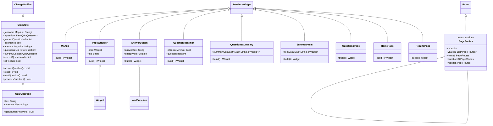
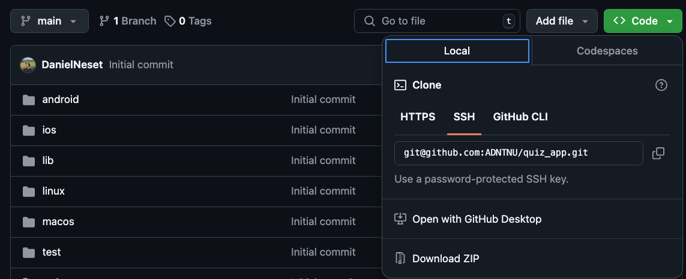
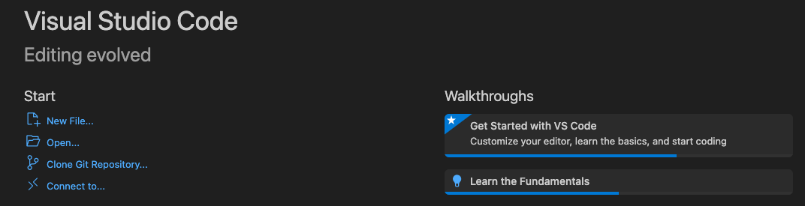
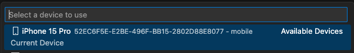
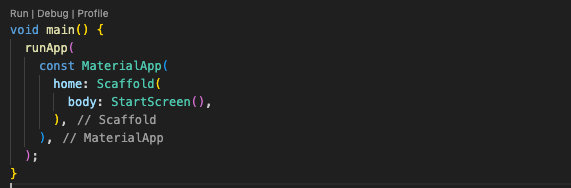

# Quiz-App

This project is a group assignment for NTNU course IDATA2503, where we are to build an Quiz App for mobile. We will heavily follow a [udemy](https://www.udemy.com/course/learn-flutter-dart-to-build-ios-android-apps/?couponCode=24T4MT90924A) course and add our own features on top of that.

- [The app](#the-app)
- [User stories](#user-stories)
- [Files and folder structure](#files-and-folder-structure)
- [App architecture](#app-architecture)
- [Specifications](#specifications)
- [Class Diagram](#class-diagram)
- [How to run this project](#how-to-run-this-project)
- [How we worked as a group](#how-we-worked-as-a-group)

## The app

The app is built using flutter and dart and tested on emulated IOS and
android phones. It is a simple Quiz app where we hard-code in questions and the
first answer in the list is the correct one. The user lands on a start screen where they can choose to start the quiz. Then we display a text with posible answers and let the user select one before we change to new questions. After every question is answered a results page will be shown to the user so that they can see what they answerd and if it was correct.

## User stories

### User story 1

As a user,
I want to be able to start a new quiz,
so that I can answer a set of questions.

Acceptance Criteria:

- The user can tap a "Start Quiz" button to begin.
- The user is presented with a set of multiple-choice questions.
- The app should display the total number of questions at the beginning of the quiz.

### User story 2

As a user,
I want to be able to select an answer for each question,
so that I can participate in the quiz.

Acceptance Criteria:

- The user is shown one question at a time.
- The user can select one of several possible answers for each question.
- The app should show a "Next" button to move to the next question after an answer is selected.

### User story 3

As a user,
I want to see how many questions I have answered and how many are left,
so that I know my progress through the quiz.

Acceptance Criteria:

- The app shows the current question number (e.g., "Question 3 of 5").
- After each question is answered, the progress indicator updates.

## Files and Folder structure

### Components

All the components for the app is stored in a components folder. With components we mean UI split up into smaller pieces that can be reused in the application.

### Data

The data folder contains all the data used in the app. In this project, the only data is the questions used in the app.

### Models

The models folder contains all the data models in the app. The only model we use in this app is for the questions.

### Pages

The pages folder contains all the pages of the application as well as a file 'pages' that contains an enum with all valid page routes.

### States

The states folder contains all the states used by the app. In this app we only use one state for the Quiz.

### Main (file)

The main file contains code to start the app and set up the different page routes.

## App architecture

Our architecture consist of State full and less classes that display widgets to the UI and fetch questions from a data.dart file. In the UI-layer we use Widgets to display the start, questions and end screen for the user. The state managment hold infromation about the users answers, witch screen you on and etc. The data layer hold information about the questions and answers.

## Specifications

Specifications of this app is that i works on both IOS and Androind.

The user should be able to start the quiz, answer the questions and get the result at the end.

## Class Diagram

We are using mermaid to display the Class Diagram in this Github repo, and dcdg to create the diagram. This will be updated in the future when the extra feature is added.



## How to run this project

### Prerequisite

First off all you need to have flutter setup on you computer, if you dont follow this [tutorial](https://docs.flutter.dev/get-started/install).

### Clone the project

You first need to clone the project, or donwload it:


### Open the project

After you have cloned the repository you need to open it in you editor of choice, we use vscode:


### Select a emulator

Then you need to select an emulator for you project, we assume that you already have one ready after following the flutter documentation:


### Refresh flutter

After selecting an simulator you need might need to clean and run flutter in the root folder to get all the nesesery packages:

```sh
# Root folder in this example is the one you cloned called quiz_app.
flutter clean
flutter run
```

### Run the app

And finally run the code in the [main.dart](lib/main.dart) file:


## How we worked as a group

Anders was quite busy when we first got the assignment so we agreed that Daniel should start coding from the course on Udemy. Daniel started coding most of the app and we kept contact on Discord on how it was progressing. Some of the communication happend by text and some by voice call. When Anders had time to work on the assignment, he started working on adding a single state for the entire quiz and better navigation.

After that we both had a good understanding of how the app was structured and set up so then we started discussing what improvements we could add. We decided to add a simple display to show the current question and total number of questions. We also added buttons to navigate back through already answered questions and a button to go back to the home screen.

When we were both happy with the app we discussed what to write in our documentation and then wrote it together while talking on Discord.
